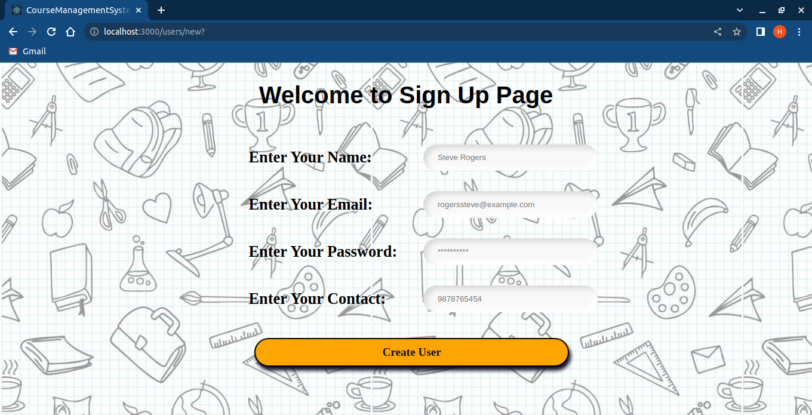

# Course Management System Using Rails

## Output ScreenShot

### Welcome Page:

### Sign Up:

### Sign In:

### Course Available:

### Course Published:

### Course Bought:

### Course Module:

### Course Adding:

